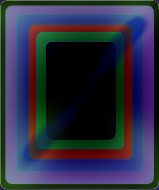
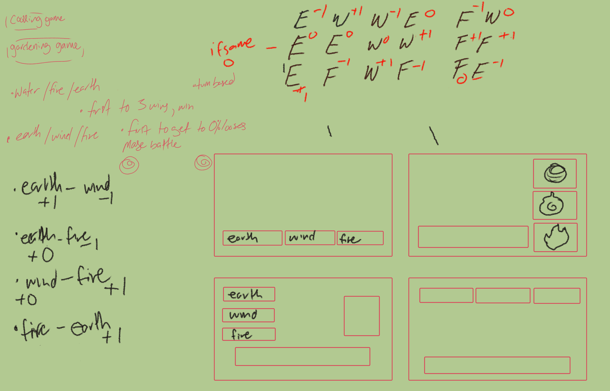
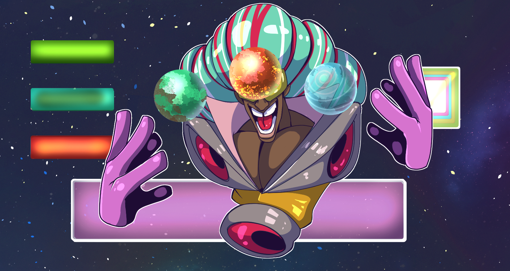
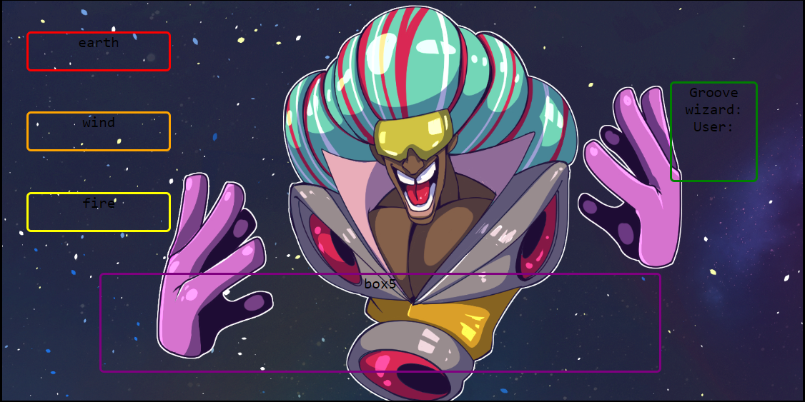

# Groove-Wizard
A small developed turn fighting game where you fight a wizard using earth wind and fire.
----------
I wanted to see If I could make a simple turn based game. It uses the same format of rock, paper, scissors. When I tried my first game I realize start small and then grow.

----------

## Getting started / Prerequistes
----------

1.Need simply  Visual Studio code with terminal node. HTML CSS JAVASCRIPT

2.chrome

3.The endurance of a thousand suns

4.Background image/gif: 

5.Button assests: 

----------

## Installing / Attempts / bugs
------
### HTML
- Boiler plate (Html 5)

- Have CSS(style.css) and JAVASCRIPT(game.js) up and link in head of boiler

- body has 1 main div with 6 other divs lined up.

- All the child divs have class = " child(by itself to link all the children together) child-(#number to know which) as well as box and name number to show up on html on screen. For child-5 this will be the start game and response boxes. child-6 will be the reset popup.

### CSS

- This is where we use grid to organize the child divs. Call all the child-1-6 classes and give them a different color border to identify each. in child class make display flex and justify content and align items to center.

- In the parent class display: with the sizes, margins(to help center), height, and width. From he it was playing around with the grid-template-columns and grid-template-rows and grid-gap to meet the ideal wireframe:

- This is the end look we are looking for.

Reference videos and websites: 

- (Overlapping CSS grid)  https://www.youtube.com/watch?v=HFG3BKOqOlE
- (Guide to grid) https://css-tricks.com/snippets/css/complete-guide-grid/
- (Guide to flexbox) https://css-tricks.com/snippets/css/a-guide-to-flexbox/
- (How to overlap divs) https://css-tricks.com/how-to-stack-elements-in-css/

The child divs are atop the parent

This is the look witht the atempted background

- to apply the art simply use:   background-image:url(image link');
   background-size: cover(to fill image);

### JavaScript

1. I assigned all the child divs to a variable.

2. Then I made each assigned variable an innerHtml to appear in each div

3. Have a userscore and computer score variable equal to zero to be added to.

4. Then for the c1-4 buttons give them event listeners to activate when press, each btn will have a different fuction corresponding for earthbtn, windbtn, firebtn ( create those functions below as well.). c4 will have the reset function

5. c4 will have c4.style.display ='none' because it will not be shown until the ending to reset the game

6. Create an empty string called playerselection which will be filled with whichever is filled

7. in each of the element functions you will have playerselection = '(name of correstonding element function ext. earth) playRound() refreshStats() winner()

8. winner() simply decided the winner and will display the c4 reset button

9. Create a reset fucntion that   document.location.reload(true) which will reset the page when clicked

10. computerPlay is a randomizer for the computer to choose earth wind or fire strings.

11. playround() is the actual switch case that plays whichever is selcted and stores it the score. You can play with which adds scores ( I tried to do decriment scores, but that made it more complicated).   PUT THE computerPlay() randomizer in the switch cases instead!

12. startGame() function activates when the c1-3 buttons are clicked witht eh event listeners inside. startGame() is called again to activate.

13. refreshStats() applies the states to the score varible and update everytime a button is pressed which goes into startGame and go through the buttons.

---------
## Goals / Adjustments
---------
It appears that each button doesnt randomize the computer play properly. Also I would love to have a decriment systems as well as the bg character showing agony and success. I know many new skills now whih wont bee hard to correct and impliment

## Credits

My Per Scholas classmates kept me motivated and understand that I'm not alone with known unknowns and unknown unknowns, It's something about struggling together you know. Also thank my Professor Tishana for teaching me the skills to even start and understand this process.
I would have never even fathomed it to even work is it wasnt for my wonderful classmate Chudi for making an effort and being so pacient with me on this project. They helped me learn a massive amount of techniques and most importanly why they are used. Torwards the end I could start implimenting corrections and adjectments. Thanks so much

## PLAY HERE

